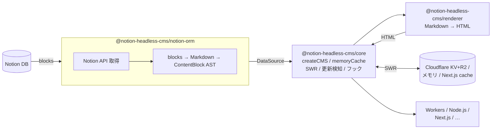

# notion-headless-cms

[](https://github.com/kjfsm/notion-headless-cms/actions/workflows/ci.yml)
[](https://github.com/kjfsm/notion-headless-cms/security/code-scanning)
[](https://codecov.io/gh/kjfsm/notion-headless-cms)
[](https://socket.dev/npm/package/@notion-headless-cms/core)
[](https://socket.dev/npm/package/@notion-headless-cms/cli)
[](https://bundlephobia.com/package/@notion-headless-cms/core)

[](https://www.npmjs.com/package/@notion-headless-cms/core)
[](https://www.npmjs.com/package/@notion-headless-cms/cli)
[](https://www.npmjs.com/package/@notion-headless-cms/notion-orm)
[](https://www.npmjs.com/package/@notion-headless-cms/renderer)
[](https://www.npmjs.com/package/@notion-headless-cms/cache)
[](https://www.npmjs.com/package/@notion-headless-cms/adapter-next)

Notion をヘッドレス CMS として利用するための TypeScript ライブラリ群。
Cloudflare Workers + R2 / KV を中心としつつ、Node.js / Next.js / Astro / Hono / SvelteKit など幅広いランタイムで動作する。pnpm モノレポで管理されている。

## データフロー



> **SWR（Stale-While-Revalidate）**: キャッシュを即返し、TTL 切れなら裏で非同期更新。
> Notion の `last_edited_time` を比較し、変更があれば HTML を再生成する。

## パッケージ一覧

### コア

#### [`@notion-headless-cms/core`](./packages/core)
CMS エンジン本体。`createCMS` は**これ一本**で Node.js / Workers / Next.js
どこでも動く。外部ランタイム依存ゼロ。
- `createCMS({ collections, cache?, renderer?, ... })` — コレクション別にアクセスできる CMS クライアントを生成
- `memoryCache({ maxItems? })` — インプロセス LRU キャッシュ
- `cms.posts.get(slug)` / `cms.posts.list(opts?)` / `params()` / `cms.posts.cache.adjacent()` / `cms.posts.cache.warm()` / `cms.posts.cache.invalidate()`
- `cms.$collections` / `cms.$invalidate(scope?)` / `cms.$getCachedImage(hash)` / `cms.$handler(opts)`
- `CMSError` / `isCMSError` / `isCMSErrorInNamespace` — 名前空間付きエラー (`core/*` / `cli/*` / `source/*` / `cache/*` / `renderer/*`)
- サブパスエクスポート `/errors` · `/hooks` · `/cache/memory` · `/cache/noop` — 必要な型だけをインポート可

#### [`@notion-headless-cms/notion-orm`](./packages/notion-orm)
Notion API 呼び出しとスキーマ解釈を担う ORM 層。`DataSource<T>` インターフェースを実装する。
npm には公開されるが、**ユーザーは直接 import しない**（CLI が生成した `createCMS` ラッパー経由で利用）。
利用側プロジェクトには依存として `pnpm add` するだけでよい。

#### [`@notion-headless-cms/renderer`](./packages/renderer)
Markdown → HTML レンダラー。remark / rehype パイプラインで変換し、GFM と画像 URL のプロキシ書き換えをサポート。
- `renderMarkdown(markdown, options?)` — `RendererFn` として core に注入可能 (または core が動的 import)
- `unified` / `remark-*` / `rehype-*` は `peerDependencies`

#### [`@notion-headless-cms/notion-embed`](./packages/notion-embed)
Notion ブロックを Notion 風 HTML にレンダリングする拡張パッケージ。`notionEmbed()` を `createCMS()` の引数に差し込むだけで有効化できる。
- bookmark ブロック → OGP カード（in-memory TTL キャッシュ付き）
- embed / video / audio / pdf / image → Steam・YouTube・Vimeo・Twitter・DLsite 等のプロバイダー対応
- callout / toggle / paragraph / heading / list / quote / to_do → Notion 風 HTML
- rich_text の mention（link_mention / page / database / date / user / custom_emoji）と全アノテーション対応
- `embedRehypePlugins()` — rehype-raw + rehype-sanitize を XSS セーフに設定して返す
```ts
import { notionEmbed, youtubeProvider } from "@notion-headless-cms/notion-embed";

const embed = notionEmbed({ providers: [youtubeProvider()] });
const cms = createCMS({
  renderer: embed.renderer,
  collections: {
    posts: {
      source: createNotionCollection({ token, dataSourceId, properties, blocks: embed.blocks }),
      slugField: "slug",
      statusField: "status",
      publishedStatuses: ["公開済み"],
    },
  },
});
```

#### [`@notion-headless-cms/cli`](./packages/cli)
Notion DB を introspect して TypeScript スキーマを自動生成する CLI ツール。
- `nhc init` — `nhc.config.ts` テンプレートを生成
- `nhc generate` — Notion DB を introspect して `nhc.ts` を生成（型付き `createCMS` ラッパーを含む）
- `defineConfig(config)` / `env(name)` — `nhc.config.ts` 用ヘルパー

---

### キャッシュ実装

#### [`@notion-headless-cms/cache`](./packages/cache)
キャッシュアダプタ集約パッケージ。メモリ・Cloudflare・Next.js のアダプタをサブパスエクスポートで提供する。

| インポートパス | エクスポート | 用途 |
|---|---|---|
| `@notion-headless-cms/cache` | `memoryCache()` | インプロセス LRU |
| `@notion-headless-cms/cache/cloudflare` | `cloudflareCache(env)` / `kvCache()` / `r2Cache()` | Cloudflare KV + R2 |
| `@notion-headless-cms/cache/next` | `nextCache()` | Next.js ISR / `unstable_cache` |

`cloudflareCache(env)` は `env.DOC_CACHE` (KV) / `env.IMG_BUCKET` (R2) を自動検出して配列で返す。
`nextCache()` は `unstable_cache` / `revalidateTag` を利用し、規約タグ `nhc:col:<name>` で細粒度 invalidate をサポート。

---

### フロントエンド連携 adapter

#### [`@notion-headless-cms/adapter-next`](./packages/adapter-next)
Next.js App Router 向けルートハンドラー。画像プロキシ配信と Notion Webhook によるキャッシュ再検証を提供する。
- `createImageRouteHandler(cms)` — `/api/images/[hash]/route.ts` 用
- `createRevalidateRouteHandler(cms, { secret })` — Webhook 受信用

## クイックスタート

### Node.js

```bash
pnpm add @notion-headless-cms/core @notion-headless-cms/notion-orm \
  @notion-headless-cms/renderer @notion-headless-cms/cache \
  @notionhq/client zod \
  unified remark-parse remark-gfm remark-rehype rehype-stringify
pnpm add -D @notion-headless-cms/cli
```

```bash
# スキーマを生成（nhc.config.ts を編集してから）
NOTION_TOKEN=secret_xxx npx nhc generate
```

```ts
// app/lib/cms.ts
import { memoryCache } from "@notion-headless-cms/cache";
import { createCMS } from "./generated/nhc";  // nhc generate が出力するファイル

export const cms = createCMS({
  notionToken: process.env.NOTION_TOKEN!,
  cache: memoryCache(),
  ttlMs: 5 * 60_000,
});

// 使い方
const posts = await cms.posts.list();
const post = await cms.posts.get("my-first-post");
if (post) console.log(await post.render());
```

### Cloudflare Workers

```bash
pnpm add @notion-headless-cms/core @notion-headless-cms/notion-orm \
  @notion-headless-cms/renderer @notion-headless-cms/cache \
  @notionhq/client zod \
  unified remark-parse remark-gfm remark-rehype rehype-stringify
```

```toml
# wrangler.toml
[[kv_namespaces]]
binding = "DOC_CACHE"
id = "xxxxxxxx"

[[r2_buckets]]
binding = "IMG_BUCKET"
bucket_name = "nhc-images"
```

```ts
import { cloudflareCache } from "@notion-headless-cms/cache/cloudflare";
import { createCMS } from "./generated/nhc";

export default {
  async fetch(req: Request, env: Env): Promise<Response> {
    const cms = createCMS({
      notionToken: env.NOTION_TOKEN,
      cache: cloudflareCache(env),
      ttlMs: 5 * 60_000,
    });
    const posts = await cms.posts.list();
    return Response.json(posts);
  },
};
```

```bash
wrangler secret put NOTION_TOKEN
```

## ドキュメント

- [クイックスタート](./docs/quickstart.md)
- [CLI ツール（nhc）](./docs/cli.md)
- [CMS メソッド一覧](./docs/api/cms-methods.md)
- レシピ
  - [マルチソース](./docs/recipes/multi-source.md)
  - [Cloudflare Workers + R2 + KV](./docs/recipes/cloudflare-workers.md)
  - [Next.js App Router](./docs/recipes/nextjs-app-router.md)
  - [Node.js スクリプト](./docs/recipes/nodejs-script.md)
  - [カスタムデータソース](./docs/recipes/custom-source.md)
  - [カスタムキャッシュアダプタ](./docs/recipes/custom-cache.md)
  - [useSWR クライアントサイド連携](./docs/recipes/useswr-integration.md)
- [v0.2 → v0.3 移行ガイド](./docs/migration/v0.3.md)
- [v0 → v1 ORM 分離の経緯](./docs/migration/v0-to-v1.md)
- [開発者ガイド](./docs/development.md)

## 開発

### 必要なツール

- Node.js 24 以上（`engines.node: ">=24"`）
- pnpm 10

### コマンド

```bash
pnpm install          # 依存関係インストール
pnpm build            # 全パッケージをビルド (tsdown)
pnpm typecheck        # 全パッケージの型チェック
pnpm test             # vitest 実行
pnpm format           # Biome でフォーマット・Lint
```

## リリース・公開

`@notion-headless-cms/*` は changesets を使ったセマンティックバージョニングで自動公開される。

```bash
# 1. 変更内容を記録する changeset を作成
pnpm changeset

# 2. main にマージすると release.yml が "Version Packages" PR を自動作成
# 3. その PR をマージすると npm に自動公開される
```

## ライセンス

MIT
