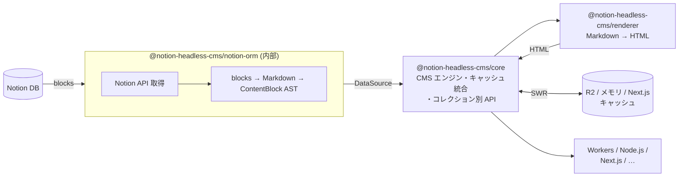

# notion-headless-cms

Notion をヘッドレス CMS として利用するための TypeScript ライブラリ群。
Cloudflare Workers + R2 を中心としつつ、Node.js / Next.js / Astro / Hono / SvelteKit など幅広いランタイムで動作する。pnpm モノレポで管理されている。

## データフロー



> **SWR（Stale-While-Revalidate）**: キャッシュを即返し、TTL 切れなら裏で非同期更新。
> Notion の `last_edited_time` を比較し、変更があれば HTML を再生成する。

## パッケージ一覧

### コア

#### [`@notion-headless-cms/core`](./packages/core)
CMS エンジン本体。`DataSource<T>` 抽象・キャッシュ・レンダラー統合・SWR / 更新検知 / フック / リトライ / Web Standard Route Handler を提供する。**外部ランタイム依存ゼロ**。
- `createCMS({ dataSources, cache?, ... })` — コレクション別にアクセスできる CMS クライアントを生成
- `cms.posts.getItem(slug)` — 本文込みで単件取得（SWR）。返り値は `T & { content: { blocks, html(), markdown() } }`
- `cms.posts.getList(opts?)` — 公開済み一覧（本文なし）
- `cms.posts.getStaticParams()` / `getStaticPaths()` — SSG 用
- `cms.posts.adjacent(slug)` — 前後記事ナビゲーション
- `cms.posts.revalidate()` / `cms.posts.prefetch()` — コレクション別キャッシュ操作
- `cms.$revalidate(scope?)` / `cms.$getCachedImage(hash)` / `cms.$handler(opts)` — グローバル操作
- `ContentBlock` AST（paragraph / heading / list / code / quote / image / divider / raw）
- `memoryDocumentCache({ maxItems? })` / `memoryImageCache({ maxItems?, maxSizeBytes? })` — LRU 対応インメモリキャッシュ
- `CMSError` / `isCMSError` / `isCMSErrorInNamespace` — 名前空間付きエラー
- サブパスエクスポート `/errors` · `/hooks` · `/cache/memory` — 必要な型だけをインポート可

#### `@notion-headless-cms/notion-orm` — 内部パッケージ（private）
Notion API 呼び出しとスキーマ解釈を担う ORM 層。`DataSource<T>` インターフェースを実装する。**ユーザーは直接 import しない**（CLI が生成した `nhcDataSources` 経由で利用）。将来的にリポジトリ分離を予定。

#### [`@notion-headless-cms/renderer`](./packages/renderer)
Markdown → HTML レンダラー。remark / rehype パイプラインで変換し、GFM と画像 URL のプロキシ書き換えをサポート。
- `renderMarkdown(markdown, options?)` — `RendererFn` として core に注入可能
- `unified` / `remark-*` / `rehype-*` は `peerDependencies`。利用側でのインストールが必要

#### [`@notion-headless-cms/cli`](./packages/cli)
Notion DB を introspect して TypeScript スキーマを自動生成する CLI ツール。`nhc generate` で `nhc-schema.ts` を生成し、マルチソースクライアントにそのまま渡せる。
- `nhc init` — `nhc.config.ts` テンプレートを生成
- `nhc generate` — Notion DB を introspect してスキーマファイルを生成
- `defineConfig(config)` — `nhc.config.ts` 用設定ヘルパー

---

### アダプター（ランタイム別）

#### [`@notion-headless-cms/adapter-cloudflare`](./packages/adapter-cloudflare)
Cloudflare Workers 向けファクトリ。`env.CACHE_BUCKET`（R2）を自動で `DocumentCacheAdapter` / `ImageCacheAdapter` に変換して注入する。
- `createCloudflareCMS({ dataSources, env, content?, ttlMs?, waitUntil? })` — `nhc generate` が生成した `nhcDataSources` を受け取り、コレクション別にアクセスできる CMS クライアントを返す。`env.CACHE_BUCKET` 未設定時はキャッシュなしで動作

#### [`@notion-headless-cms/adapter-node`](./packages/adapter-node)
Node.js 向けファクトリ。`process.env.NOTION_TOKEN` を読み取り、オプションでインメモリキャッシュを注入する。
- `createNodeCMS({ dataSources, token?, cache?, content? })` — `nhcDataSources` を受け取りコレクション別にアクセスできる CMS クライアントを返す。`cache: "disabled" | { document?: "memory"; image?: "memory"; ttlMs? }`

#### [`@notion-headless-cms/adapter-next`](./packages/adapter-next)
Next.js App Router 向けルートハンドラー。画像プロキシ配信と Notion Webhook によるキャッシュ再検証を提供する。
- `createImageRouteHandler(cms)` — `/api/images/[hash]/route.ts` 用
- `createRevalidateRouteHandler(cms, { secret })` — Webhook 受信用

---

### キャッシュ実装

#### [`@notion-headless-cms/cache-r2`](./packages/cache-r2)
Cloudflare R2 を使った `DocumentCacheAdapter` & `ImageCacheAdapter` 実装。構造型 `R2BucketLike` を受け取るため `@cloudflare/workers-types` への実依存はない。
- `r2Cache({ bucket })`

#### [`@notion-headless-cms/cache-next`](./packages/cache-next)
Next.js の `unstable_cache` / `revalidateTag` を利用した `DocumentCacheAdapter` 実装。ISR に対応する。
- `nextCache({ revalidate?, tags? })`

## ドキュメント

- [クイックスタート](./docs/quickstart.md) — 5 分で動かす最短レシピ
- [CLI ツール（nhc）](./docs/cli.md) — `nhc init` / `nhc generate` の使い方と生成ファイル構造
- [CMS メソッド一覧](./docs/api/cms-methods.md) — `cms.*` の公開メソッド
- レシピ
  - [マルチソース](./docs/recipes/multi-source.md) — 複数 DB を型安全に扱う
  - [Cloudflare Workers + R2](./docs/recipes/cloudflare-workers.md)
  - [Next.js App Router](./docs/recipes/nextjs-app-router.md)
  - [Node.js スクリプト](./docs/recipes/nodejs-script.md)
  - [カスタムデータソース](./docs/recipes/custom-source.md)
  - [カスタムキャッシュアダプタ](./docs/recipes/custom-cache.md)
- [v0 → v1 移行ガイド](./docs/migration/v0-to-v1.md)
- [開発者ガイド](./docs/development.md) — 初期設定・Secrets・MCP・CI の手順

## クイックスタート（Node.js）

Notion トークンを設定し、`nhc init` / `nhc generate` で `nhcSchema` を出力したら Node.js スクリプトとして最小構成で動かせる。

### インストール

```bash
npm install @notion-headless-cms/adapter-node @notion-headless-cms/cli
```

`adapter-node` は内部で `core` / `source-notion` / `renderer` を依存に含むため、個別インストールは不要。

### スクリプト例

```ts
// fetch-posts.ts
import { createNodeCMS } from "@notion-headless-cms/adapter-node";
import { nhcSchema } from "./generated/nhc-schema";

const client = createNodeCMS({
  schema: nhcSchema,
  sources: {
    posts: { published: ["公開"] },
  },
});

// 記事一覧を取得
const posts = await client.posts.list();
console.log(posts);

// スラッグから HTML を生成
const post = await client.posts.find("my-first-post");
if (post) {
  const rendered = await client.posts.render(post);
  console.log(rendered.html);
}
```

```bash
NOTION_TOKEN=xxx npx tsx fetch-posts.ts
```

> R2 キャッシュ不要のローカル開発・バッチ処理向け。
> Cloudflare Workers + R2 を使った本番構成は次節を参照。

## クイックスタート（Cloudflare Workers）

### wrangler.toml

```toml
[[r2_buckets]]
binding = "CACHE_BUCKET"
bucket_name = "nhc-example-cache"
```

### Workers エントリーポイント

```typescript
import { createCloudflareCMS, type CloudflareCMSEnv } from "@notion-headless-cms/adapter-cloudflare";
import { nhcSchema } from "./generated/nhc-schema";

export default {
  async fetch(request: Request, env: CloudflareCMSEnv): Promise<Response> {
    const client = createCloudflareCMS({
      schema: nhcSchema,
      env,
      sources: {
        posts: {
          published: ["公開"],
          accessible: ["公開", "下書き"],
        },
      },
      ttlMs: 5 * 60 * 1000,
    });

    const url = new URL(request.url);

    if (url.pathname === "/posts") {
      const { items } = await client.posts.cache.getList();
      return Response.json(items);
    }

    const slug = url.pathname.replace("/posts/", "");
    const cached = await client.posts.cache.get(slug);
    if (!cached) return new Response("Not Found", { status: 404 });

    return new Response(cached.html, {
      headers: { "Content-Type": "text/html; charset=utf-8" },
    });
  },
};
```

### 環境変数

```bash
wrangler secret put NOTION_TOKEN
```

## 開発

初期設定・GitHub Secrets・Claude Code 拡張機能（MCP / plugin）の登録手順などは [開発者ガイド](./docs/development.md) を参照。

### 必要なツール

- Node.js 24 以上（`engines.node: ">=24"`）
- pnpm 10

### コマンド

```bash
pnpm install          # 依存関係インストール
pnpm build            # 全パッケージをビルド（tsup）
pnpm typecheck        # 全パッケージの型チェック
pnpm test             # vitest 実行
pnpm format           # Biome でフォーマット・Lint
```

### 個別パッケージ

```bash
cd packages/core
pnpm build
pnpm typecheck
```

## リリース・公開

`@notion-headless-cms/*` は changesets を使ったセマンティックバージョニングで自動公開される。

```bash
# 1. 変更内容を記録する changeset を作成
pnpm changeset

# 2. main にマージすると release.yml が "Version Packages" PR を自動作成

# 3. その PR をマージすると npm に自動公開される
```

## ライセンス

MIT
