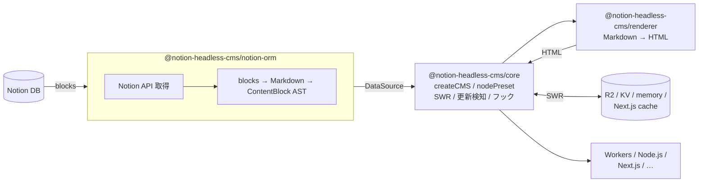

# notion-headless-cms

[](https://codecov.io/gh/kjfsm/notion-headless-cms)

Notion をヘッドレス CMS として利用するための TypeScript ライブラリ群。
Cloudflare Workers + R2 / KV を中心としつつ、Node.js / Next.js / Astro / Hono / SvelteKit など幅広いランタイムで動作する。pnpm モノレポで管理されている。

## データフロー



> **SWR（Stale-While-Revalidate）**: キャッシュを即返し、TTL 切れなら裏で非同期更新。
> Notion の `last_edited_time` を比較し、変更があれば HTML を再生成する。

## パッケージ一覧

### コア

#### [`@notion-headless-cms/core`](./packages/core)
CMS エンジン本体。`createCMS` は**これ一本**で Node.js / Workers / Next.js
どこでも動く。ランタイム差分は preset で吸収する。外部ランタイム依存ゼロ。
- `createCMS({ dataSources, cache?, renderer?, ... })` — コレクション別にアクセスできる CMS クライアントを生成
- `nodePreset({ cache?, ttlMs?, renderer? })` — Node.js 向けプリセット (memory cache をデフォルト有効化)
- `cms.posts.getItem(slug)` / `cms.posts.getList(opts?)` / `getStaticParams()` / `adjacent()` / `revalidate()` / `prefetch()`
- `cms.$revalidate(scope?)` / `cms.$getCachedImage(hash)` / `cms.$handler(opts)`
- `memoryDocumentCache` / `memoryImageCache` (LRU 対応) / `noopDocumentCache` / `noopImageCache`
- `CMSError` / `isCMSError` / `isCMSErrorInNamespace` — 名前空間付きエラー (`core/*` / `cli/*` / `source/*` / `cache/*` / `renderer/*`)
- サブパスエクスポート `/errors` · `/hooks` · `/cache/memory` — 必要な型だけをインポート可

#### [`@notion-headless-cms/notion-orm`](./packages/notion-orm)
Notion API 呼び出しとスキーマ解釈を担う ORM 層。`DataSource<T>` インターフェースを実装する。
npm には公開されるが、**ユーザーは直接 import しない**（CLI が生成した `cmsDataSources` 経由で利用）。
利用側プロジェクトには依存として `pnpm add` するだけでよい。

#### [`@notion-headless-cms/renderer`](./packages/renderer)
Markdown → HTML レンダラー。remark / rehype パイプラインで変換し、GFM と画像 URL のプロキシ書き換えをサポート。
- `renderMarkdown(markdown, options?)` — `RendererFn` として core に注入可能 (または core が動的 import)
- `unified` / `remark-*` / `rehype-*` は `peerDependencies`

#### [`@notion-headless-cms/notion-embed`](./packages/notion-embed)
Notion ブロックを Notion 風 HTML にレンダリングする拡張パッケージ。`notionEmbed()` を `createCMS()` の引数に差し込むだけで有効化できる。
- bookmark ブロック → OGP カード（in-memory TTL キャッシュ付き）
- embed / video / audio / pdf / image → Steam・YouTube・Vimeo・Twitter・DLsite 等のプロバイダー対応
- callout / toggle / paragraph / heading / list / quote / to_do → Notion 風 HTML
- rich_text の mention（link_mention / page / database / date / user / custom_emoji）と全アノテーション対応
- `embedRehypePlugins()` — rehype-raw + rehype-sanitize を XSS セーフに設定して返す
```ts
const embed = notionEmbed({ providers: [steamProvider(), dlsiteProvider()] });
export const cms = createCMS({
  ...nodePreset({ renderer: embed.renderer }),
  dataSources: { posts: postsCollection({ blocks: embed.blocks }) },
});
```

#### [`@notion-headless-cms/cli`](./packages/cli)
Notion DB を introspect して TypeScript スキーマを自動生成する CLI ツール。
- `nhc init` — `nhc.config.ts` テンプレートを生成
- `nhc generate` — Notion DB を introspect して `nhc-schema.ts` を生成
- `defineConfig(config)` / `env(name)` — `nhc.config.ts` 用ヘルパー

---

### キャッシュ実装 + ランタイムプリセット

#### [`@notion-headless-cms/cache-r2`](./packages/cache-r2)
Cloudflare R2 を使った `DocumentCacheAdapter` & `ImageCacheAdapter` 実装。構造型 `R2BucketLike` を受け取るため `@cloudflare/workers-types` への実依存はない。
- `r2Cache({ bucket })`
- `cloudflarePreset({ env, ttlMs?, bindings? })` — Cloudflare Workers 向けプリセット。env 経由で KV / R2 / NOTION_TOKEN を解決

#### [`@notion-headless-cms/cache-kv`](./packages/cache-kv)
Cloudflare KV を使った `DocumentCacheAdapter` 実装。
- `kvCache({ kv })`

#### [`@notion-headless-cms/cache-next`](./packages/cache-next)
Next.js の `unstable_cache` / `revalidateTag` を利用した `DocumentCacheAdapter` 実装。ISR に対応する。規約タグ `nhc:col:<name>` / `nhc:col:<name>:slug:<slug>` で細粒度 invalidate をサポート。
- `nextCache({ revalidate?, tags? })`

---

### フロントエンド連携 adapter

#### [`@notion-headless-cms/adapter-next`](./packages/adapter-next)
Next.js App Router 向けルートハンドラー。画像プロキシ配信と Notion Webhook によるキャッシュ再検証を提供する。
- `createImageRouteHandler(cms)` — `/api/images/[hash]/route.ts` 用
- `createRevalidateRouteHandler(cms, { secret })` — Webhook 受信用

> v0.3.0 から `adapter-*` はフロントエンド / フレームワーク連携に用途限定。
> ランタイム別 adapter (`adapter-node` / `adapter-cloudflare`) は廃止され、
> それぞれ `nodePreset` (core) / `cloudflarePreset` (cache-r2) に統合された。

## クイックスタート

### Node.js

```bash
pnpm add @notion-headless-cms/core @notion-headless-cms/notion-orm \
  @notion-headless-cms/renderer @notionhq/client zod \
  unified remark-parse remark-gfm remark-rehype rehype-stringify
pnpm add -D @notion-headless-cms/cli
```

```ts
// app/lib/cms.ts
import { createCMS, nodePreset } from "@notion-headless-cms/core";
import { cmsDataSources } from "./generated/nhc-schema";

export const cms = createCMS({
  ...nodePreset({ ttlMs: 5 * 60_000 }),
  dataSources: cmsDataSources,
});

// 使い方
const posts = await cms.posts.getList();
const post = await cms.posts.getItem("my-first-post");
if (post) console.log(await post.content.html());
```

### Cloudflare Workers

```bash
pnpm add @notion-headless-cms/core @notion-headless-cms/cache-r2 \
  @notion-headless-cms/notion-orm @notion-headless-cms/renderer
```

```toml
# wrangler.toml
[[kv_namespaces]]
binding = "DOC_CACHE"
id = "xxxxxxxx"

[[r2_buckets]]
binding = "IMG_BUCKET"
bucket_name = "nhc-images"
```

```ts
import { createCMS } from "@notion-headless-cms/core";
import { cloudflarePreset } from "@notion-headless-cms/cache-r2";
import { cmsDataSources } from "./generated/nhc-schema";

export default {
  async fetch(req: Request, env: Env): Promise<Response> {
    const cms = createCMS({
      ...cloudflarePreset({ env, ttlMs: 5 * 60_000 }),
      dataSources: cmsDataSources,
    });
    const posts = await cms.posts.getList();
    return Response.json(posts);
  },
};
```

```bash
wrangler secret put NOTION_TOKEN
```

## ドキュメント

- [クイックスタート](./docs/quickstart.md)
- [CLI ツール（nhc）](./docs/cli.md)
- [CMS メソッド一覧](./docs/api/cms-methods.md)
- レシピ
  - [マルチソース](./docs/recipes/multi-source.md)
  - [Cloudflare Workers + R2 + KV](./docs/recipes/cloudflare-workers.md)
  - [Next.js App Router](./docs/recipes/nextjs-app-router.md)
  - [Node.js スクリプト](./docs/recipes/nodejs-script.md)
  - [カスタムデータソース](./docs/recipes/custom-source.md)
  - [カスタムキャッシュアダプタ](./docs/recipes/custom-cache.md)
- [v0.2 → v0.3 移行ガイド](./docs/migration/v0.3.md)
- [v0 → v1 ORM 分離の経緯](./docs/migration/v0-to-v1.md)
- [開発者ガイド](./docs/development.md)

## 開発

### 必要なツール

- Node.js 24 以上（`engines.node: ">=24"`）
- pnpm 10

### コマンド

```bash
pnpm install          # 依存関係インストール
pnpm build            # 全パッケージをビルド (tsdown)
pnpm typecheck        # 全パッケージの型チェック
pnpm test             # vitest 実行
pnpm format           # Biome でフォーマット・Lint
```

## リリース・公開

`@notion-headless-cms/*` は changesets を使ったセマンティックバージョニングで自動公開される。

```bash
# 1. 変更内容を記録する changeset を作成
pnpm changeset

# 2. main にマージすると release.yml が "Version Packages" PR を自動作成
# 3. その PR をマージすると npm に自動公開される
```

## ライセンス

MIT
