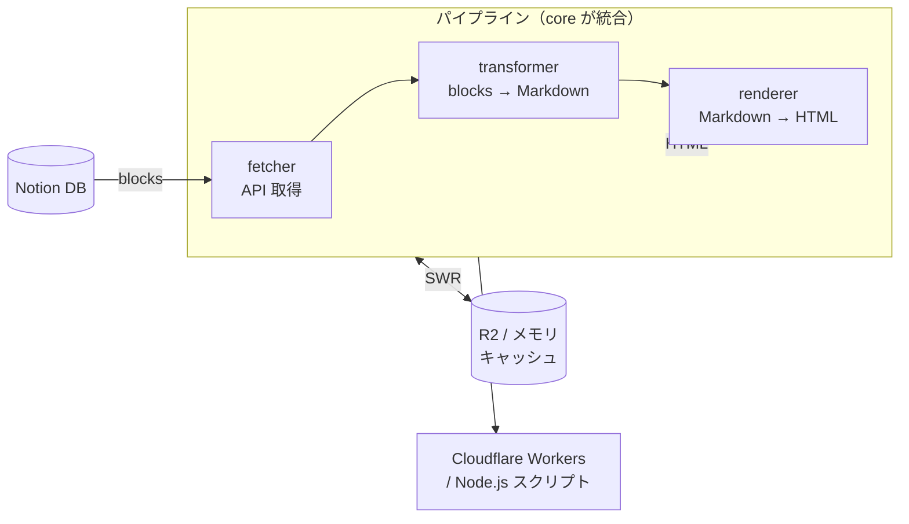

# notion-headless-cms

Notion をヘッドレス CMS として利用するための TypeScript ライブラリ群。
Cloudflare Workers + R2 での利用を前提に設計されており、pnpm モノレポで管理されている。

## データフロー



> **SWR（Stale-While-Revalidate）**: キャッシュを即返し、TTL 切れなら裏で非同期更新。
> Notion の `last_edited_time` を比較し、変更があれば HTML を再生成する。

## パッケージ一覧

### コアパイプライン

#### [`@notion-headless-cms/source-notion`](./packages/source-notion)
Notion データベースを CMS データソースとして利用するためのアダプター。型安全なスキーマ定義ヘルパー付き。
- `notionAdapter(opts)` — DataSourceAdapter を返すファクトリー
- `defineSchema(columns)` / `col.*` — 型安全なカラム定義

#### [`@notion-headless-cms/fetcher`](./packages/fetcher)
Notion API クライアントラッパー。データベース全ページとページ全ブロックを再帰取得する。
- `createNotionClient(token)`
- `fetchDatabase(client, databaseId)`
- `fetchBlocks(client, pageId)`

#### [`@notion-headless-cms/transformer`](./packages/transformer)
Notion ブロック → Markdown 変換器。`notion-to-md` ベースで、カスタムブロックハンドラーを追加できる。
- `createTransformer(client, handlers?)`
- `transformBlocks(transformer, pageId)`

#### [`@notion-headless-cms/renderer`](./packages/renderer)
Markdown → HTML レンダラー。remark/rehype パイプラインで変換し、GFM と画像 URL のプロキシ書き換えをサポート。
- `createRenderer(options?)`
- `renderMarkdown(renderer, markdown)`

#### [`@notion-headless-cms/core`](./packages/core)
CMS エンジン本体。上記パイプラインを統合し、Stale-While-Revalidate キャッシュと Notion 更新検知を管理する。
- `createCMS(options)` — CMS インスタンス生成
- `cms.list()` / `cms.renderBySlug(slug)` — 一覧・記事取得
- `memoryCache()` / `memoryImageCache()` — インメモリキャッシュ

---

### アダプター（デプロイ環境別）

#### [`@notion-headless-cms/adapter-cloudflare`](./packages/adapter-cloudflare)
Cloudflare Workers 向けファクトリー。R2 バケットと環境変数を自動注入した CMS インスタンスを生成する。
- `createCloudflareCMS(env, config?)`

#### [`@notion-headless-cms/adapter-next`](./packages/adapter-next)
Next.js App Router 向けルートハンドラー。画像プロキシ配信と Notion Webhook によるキャッシュ再検証を提供する。
- `createImageRouteHandler(cms)` — `/api/images/[hash]/route.ts` 用
- `createRevalidateRouteHandler(cms, opts)` — Webhook 受信・ISR 再検証用

---

### キャッシュ実装

#### [`@notion-headless-cms/cache-r2`](./packages/cache-r2)
Cloudflare R2 StorageAdapter 実装。core の `StorageAdapter` インターフェースを R2 バケットで実装する。
- `createCloudflareR2StorageAdapter(bucket?)`

#### [`@notion-headless-cms/cache-next`](./packages/cache-next)
Next.js の `unstable_cache` / `revalidateTag` を利用した DocumentCacheAdapter 実装。ISR に対応する。
- `nextCache(opts?)` — Next.js 用 DocumentCacheAdapter ファクトリー

## クイックスタート（Node.js）

Notion トークンとデータベース ID があれば、Node.js スクリプトとして最小構成で動かせる。

### インストール

```bash
npm install @notion-headless-cms/core @notion-headless-cms/source-notion
```

### スクリプト例

```ts
// fetch-posts.ts
import { createCMS } from "@notion-headless-cms/core";
import { notionAdapter } from "@notion-headless-cms/source-notion";

const cms = createCMS({
  source: notionAdapter({
    token: process.env.NOTION_TOKEN!,
    dataSourceId: process.env.NOTION_DATA_SOURCE_ID!,
  }),
  schema: { publishedStatuses: ["公開"] },
});

// 記事一覧を取得
const posts = await cms.list();
console.log(posts);

// スラッグで HTML を取得
const rendered = await cms.renderBySlug("my-first-post");
console.log(rendered?.html);
```

```bash
NOTION_TOKEN=xxx NOTION_DATA_SOURCE_ID=yyy npx tsx fetch-posts.ts
```

> R2 キャッシュ不要のローカル開発・バッチ処理向け。
> Cloudflare Workers + R2 を使った本番構成は次節を参照。

## クイックスタート（Cloudflare Workers）

### wrangler.toml

```toml
[[r2_buckets]]
binding = "CACHE_BUCKET"
bucket_name = "nhc-example-cache"
```

### Workers エントリーポイント

```typescript
import { createCloudflareCMS } from "@notion-headless-cms/adapter-cloudflare";

export default {
  async fetch(request: Request, env: Env): Promise<Response> {
    const cms = createCloudflareCMS(env, {
      schema: {
        publishedStatuses: ["公開"],
        accessibleStatuses: ["公開", "下書き"],
      },
      cache: { ttlMs: 5 * 60 * 1000 },
    });

    const url = new URL(request.url);

    if (url.pathname === "/posts") {
      const { items } = await cms.getItems();
      return Response.json(items);
    }

    const slug = url.pathname.replace("/posts/", "");
    const cached = await cms.getItemBySlug(slug);
    if (!cached) return new Response("Not Found", { status: 404 });

    return new Response(cached.html, {
      headers: { "Content-Type": "text/html" },
    });
  },
};
```

### 環境変数

```bash
wrangler secret put NOTION_TOKEN
wrangler secret put NOTION_DATA_SOURCE_ID
```

## 開発

### 必要なツール

- Node.js 22
- pnpm 10

### コマンド

```bash
pnpm install          # 依存関係インストール
pnpm build            # 全パッケージをビルド（tsup）
pnpm typecheck        # 全パッケージの型チェック
pnpm format           # Biome でフォーマット・Lint
```

### 個別パッケージ

```bash
cd packages/core
pnpm build
pnpm typecheck
```

## リリース・公開

npm への公開は CI（`.github/workflows/publish.yml`）が自動処理する。

```bash
# バージョンタグを打つと CI がトリガーされる
git tag v0.2.0
git push origin v0.2.0
```

手動公開も `workflow_dispatch` で実行できる（GitHub Actions の UI から）。

## ライセンス

MIT
