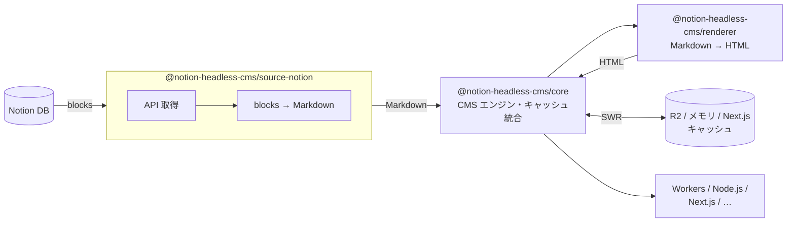

# notion-headless-cms

Notion をヘッドレス CMS として利用するための TypeScript ライブラリ群。
Cloudflare Workers + R2 を中心としつつ、Node.js / Next.js / Astro / Hono / SvelteKit など幅広いランタイムで動作する。pnpm モノレポで管理されている。

## データフロー



> **SWR（Stale-While-Revalidate）**: キャッシュを即返し、TTL 切れなら裏で非同期更新。
> Notion の `last_edited_time` を比較し、変更があれば HTML を再生成する。

## パッケージ一覧

### コア

#### [`@notion-headless-cms/core`](./packages/core)
CMS エンジン本体。データソース・キャッシュ・レンダラーを統合し、Stale-While-Revalidate / 更新検知 / クエリビルダー / フック / リトライを提供する。**外部ランタイム依存ゼロ**。
- `createCMS(options)` / `CMS` — CMS インスタンス生成
- `cms.list()` / `cms.find(slug)` / `cms.render(item)` — ソースから直接取得
- `cms.cache.read.list()` / `cms.cache.read.get(slug)` — SWR 取得
- `cms.cache.manage.prefetchAll()` / `revalidate()` / `sync()` / `checkList()` / `checkItem()` — キャッシュ管理
- `cms.query()` — ステータス・タグ・述語・ソート・ページネーション
- `memoryDocumentCache({ maxItems? })` / `memoryImageCache({ maxItems?, maxSizeBytes? })` — LRU 対応インメモリキャッシュ
- `CMSError` / `isCMSError` / `isCMSErrorInNamespace` — 名前空間付きエラー
- サブパスエクスポート `/errors` · `/hooks` · `/cache/memory` — 必要な型だけをインポート可

#### [`@notion-headless-cms/source-notion`](./packages/source-notion)
Notion データベースを `DataSourceAdapter` として実装するアダプタ。Zod スキーマを使った型安全マッピングに対応。
- `notionAdapter({ token, dataSourceId, schema?, mapItem?, properties?, blocks? })`
- `defineSchema(zodSchema, mapping)` / `defineMapping<T>(mapping)` — 型安全なスキーマ定義
- `NotionPage` / `NotionRichTextItem` 型を再エクスポート（`mapItem` 用）
- `@notionhq/client` と `zod` は `peerDependencies`。利用側でのインストールが必要

#### [`@notion-headless-cms/renderer`](./packages/renderer)
Markdown → HTML レンダラー。remark / rehype パイプラインで変換し、GFM と画像 URL のプロキシ書き換えをサポート。
- `renderMarkdown(markdown, options?)` — `RendererFn` として core に注入可能
- `unified` / `remark-*` / `rehype-*` は `peerDependencies`。利用側でのインストールが必要

---

### アダプター（ランタイム別）

#### [`@notion-headless-cms/adapter-cloudflare`](./packages/adapter-cloudflare)
Cloudflare Workers 向けファクトリ。`env.CACHE_BUCKET`（R2）を自動で `DocumentCacheAdapter` / `ImageCacheAdapter` に変換して注入する。
- `createCloudflareCMS({ env, schema?, content?, ttlMs? })` — `env.CACHE_BUCKET` 未設定時はキャッシュなしで動作

#### [`@notion-headless-cms/adapter-node`](./packages/adapter-node)
Node.js 向けファクトリ。`process.env.NOTION_TOKEN` / `NOTION_DATA_SOURCE_ID` を読み取り、オプションでインメモリキャッシュを注入する。
- `createNodeCMS({ schema?, content?, cache? })` — `cache: "disabled" | { document?: "memory"; image?: "memory"; ttlMs? }`

#### [`@notion-headless-cms/adapter-next`](./packages/adapter-next)
Next.js App Router 向けルートハンドラー。画像プロキシ配信と Notion Webhook によるキャッシュ再検証を提供する。
- `createImageRouteHandler(cms)` — `/api/images/[hash]/route.ts` 用
- `createRevalidateRouteHandler(cms, { secret })` — Webhook 受信用

---

### キャッシュ実装

#### [`@notion-headless-cms/cache-r2`](./packages/cache-r2)
Cloudflare R2 を使った `DocumentCacheAdapter` & `ImageCacheAdapter` 実装。構造型 `R2BucketLike` を受け取るため `@cloudflare/workers-types` への実依存はない。
- `r2Cache({ bucket })`

#### [`@notion-headless-cms/cache-next`](./packages/cache-next)
Next.js の `unstable_cache` / `revalidateTag` を利用した `DocumentCacheAdapter` 実装。ISR に対応する。
- `nextCache({ revalidate?, tags? })`

## ドキュメント

- [クイックスタート](./docs/quickstart.md) — 5 分で動かす最短レシピ
- [CMS メソッド一覧](./docs/api/cms-methods.md) — `cms.*` の公開メソッド
- レシピ
  - [Cloudflare Workers + R2](./docs/recipes/cloudflare-workers.md)
  - [Next.js App Router](./docs/recipes/nextjs-app-router.md)
  - [Node.js スクリプト](./docs/recipes/nodejs-script.md)
  - [カスタムデータソース](./docs/recipes/custom-source.md)
  - [カスタムキャッシュアダプタ](./docs/recipes/custom-cache.md)
- [v0 → v1 移行ガイド](./docs/migration/v0-to-v1.md)

## クイックスタート（Node.js）

Notion トークンとデータベース ID があれば、Node.js スクリプトとして最小構成で動かせる。

### インストール

```bash
npm install @notion-headless-cms/adapter-node
```

`adapter-node` は内部で `core` / `source-notion` / `renderer` を依存に含むため、個別インストールは不要。

### スクリプト例

```ts
// fetch-posts.ts
import { createNodeCMS } from "@notion-headless-cms/adapter-node";

const cms = createNodeCMS({
  schema: { publishedStatuses: ["公開"] },
});

// 記事一覧を取得
const posts = await cms.list();
console.log(posts);

// スラッグから HTML を生成
const post = await cms.find("my-first-post");
if (post) {
  const rendered = await cms.render(post);
  console.log(rendered.html);
}
```

```bash
NOTION_TOKEN=xxx NOTION_DATA_SOURCE_ID=yyy npx tsx fetch-posts.ts
```

> R2 キャッシュ不要のローカル開発・バッチ処理向け。
> Cloudflare Workers + R2 を使った本番構成は次節を参照。

## クイックスタート（Cloudflare Workers）

### wrangler.toml

```toml
[[r2_buckets]]
binding = "CACHE_BUCKET"
bucket_name = "nhc-example-cache"
```

### Workers エントリーポイント

```typescript
import { createCloudflareCMS, type CloudflareCMSEnv } from "@notion-headless-cms/adapter-cloudflare";

export default {
  async fetch(request: Request, env: CloudflareCMSEnv): Promise<Response> {
    const cms = createCloudflareCMS({
      env,
      schema: {
        publishedStatuses: ["公開"],
        accessibleStatuses: ["公開", "下書き"],
      },
      ttlMs: 5 * 60 * 1000,
    });

    const url = new URL(request.url);

    if (url.pathname === "/posts") {
      const { items } = await cms.cache.read.list();
      return Response.json(items);
    }

    const slug = url.pathname.replace("/posts/", "");
    const cached = await cms.cache.read.get(slug);
    if (!cached) return new Response("Not Found", { status: 404 });

    return new Response(cached.html, {
      headers: { "Content-Type": "text/html; charset=utf-8" },
    });
  },
};
```

### 環境変数

```bash
wrangler secret put NOTION_TOKEN
wrangler secret put NOTION_DATA_SOURCE_ID
```

## 開発

### 必要なツール

- Node.js 24 以上（`engines.node: ">=24"`）
- pnpm 10

### コマンド

```bash
pnpm install          # 依存関係インストール
pnpm build            # 全パッケージをビルド（tsup）
pnpm typecheck        # 全パッケージの型チェック
pnpm test             # vitest 実行
pnpm format           # Biome でフォーマット・Lint
```

### 個別パッケージ

```bash
cd packages/core
pnpm build
pnpm typecheck
```

## リリース・公開

`@notion-headless-cms/*` は changesets を使ったセマンティックバージョニングで自動公開される。

```bash
# 1. 変更内容を記録する changeset を作成
pnpm changeset

# 2. main にマージすると release.yml が "Version Packages" PR を自動作成

# 3. その PR をマージすると npm に自動公開される
```

## ライセンス

MIT
