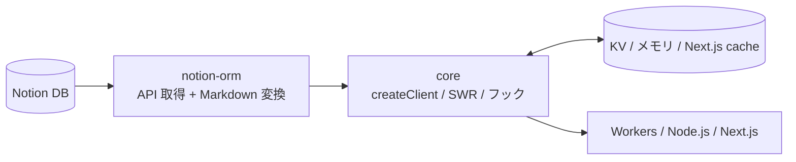

# notion-headless-cms

[](https://github.com/kjfsm/notion-headless-cms/actions/workflows/ci.yml)
[](https://codecov.io/gh/kjfsm/notion-headless-cms)
[](https://www.npmjs.com/package/@notion-headless-cms/core)

Notion をヘッドレス CMS として利用するための TypeScript ライブラリ群。Node.js・Next.js・Cloudflare Workers に対応。SWR キャッシュ・画像プロキシ・Webhook 受信を標準装備。

---

## 30 秒で動かす (Node.js)

### 1. インストール

```bash
pnpm add @notion-headless-cms/node @notion-headless-cms/cli
# peer deps
pnpm add @notionhq/client zod notion-to-md
```

### 2. Notion インテグレーション設定

1. [Notion Integrations](https://www.notion.so/my-integrations) でインテグレーションを作成
2. 対象データベースをそのインテグレーションに「接続」
3. `NOTION_TOKEN=ntn_xxx` を環境変数に設定

Notion DB には最低限これらプロパティが必要です:

| プロパティ名 | タイプ | 役割 |
|---|---|---|
| Name (title) | タイトル | ページ名 |
| slug | テキスト | URL スラッグ（一意） |
| status | ステータス | 公開状態 |

### 3. スキーマ生成

```bash
# nhc.config.ts を作成
cat > nhc.config.ts << 'EOF'
import { defineConfig, env } from "@notion-headless-cms/cli";

export default defineConfig({
  notionToken: env("NOTION_TOKEN"),
  collections: {
    // dbName で Notion DB を検索して ID を自動解決します
    posts: { dbName: "ブログ記事DB", slugField: "slug", statusField: "status" },
  },
});
EOF

# スキーマ生成
npx nhc generate
```

### 4. クライアント作成

```ts
// src/lib/cms.ts
import { createClient, nodePreset, notionSource } from "@notion-headless-cms/node";
import { schema } from "./generated/nhc.js";

export const cms = createClient({
  sources: {
    notion: notionSource({
      schema,
      token: process.env.NOTION_TOKEN!,
      publishOptions: {
        posts: { publishedStatuses: ["公開済み"] },
      },
    }),
  },
  ...nodePreset(),
});
```

### 5. データ取得

```ts
const posts = await cms.posts.list();
const post = await cms.posts.find("my-first-post");
console.log(post?.title, post?.content); // HTML が入っています
```

---

## ランタイム別セットアップ

### Cloudflare Workers

```bash
pnpm add @notion-headless-cms/cloudflare @notion-headless-cms/cli
pnpm add @notionhq/client zod notion-to-md
```

```ts
// src/lib/cms.ts
import { cloudflarePreset, createClient, notionSource } from "@notion-headless-cms/cloudflare";
import { schema } from "../generated/nhc";

export function makeCms(
  env: { NOTION_TOKEN: string; DOC_CACHE?: KVNamespace; IMG_BUCKET?: R2Bucket },
  ctx: ExecutionContext,
) {
  return createClient({
    sources: {
      notion: notionSource({
        schema,
        token: env.NOTION_TOKEN,
        publishOptions: { posts: { publishedStatuses: ["公開済み"] } },
      }),
    },
    ...cloudflarePreset({ env, ctx }),
  });
}
```

> **注意**: `ctx` (ExecutionContext) は必須です。省略すると SWR のバックグラウンド更新がレスポンス送信後に打ち切られ、キャッシュが更新されません。

### Next.js (App Router)

```bash
pnpm add @notion-headless-cms/next @notion-headless-cms/cache @notion-headless-cms/cli
pnpm add @notionhq/client zod notion-to-md
```

```ts
// app/lib/cms.ts
import { createClient, notionSource } from "@notion-headless-cms/next";
import { memoryCache } from "@notion-headless-cms/cache";
import { schema } from "@/app/generated/nhc";

export const cms = createClient({
  sources: {
    notion: notionSource({
      schema,
      token: process.env.NOTION_TOKEN!,
      publishOptions: { posts: { publishedStatuses: ["公開済み"] } },
    }),
  },
  cache: [memoryCache()],
});
```

```ts
// app/api/cms/[...path]/route.ts
import { createNextHandler } from "@notion-headless-cms/next";
import { cms } from "@/app/lib/cms";

const handler = createNextHandler(cms, { webhookSecret: process.env.REVALIDATE_SECRET });
export const GET = handler;
export const POST = handler;
```

このハンドラは画像プロキシ (`/api/cms/images/:hash`) と Webhook (`/api/cms/revalidate`) の 2 ルートをまとめて受ける。Notion 画像 URL は約 1 時間で失効するため、`cms` 経由で生成された HTML 内の画像はこのプロキシ URL (`{imageProxyBase}/{sha256}`、デフォルト `/api/images`) に書き換えられ、キャッシュから配信される。

ハンドラを使わず個別の route で受けたい場合のサンプル:

```ts
// app/api/cms/images/[hash]/route.ts
import { cms } from "@/app/lib/cms";

export async function GET(
  _req: Request,
  { params }: { params: Promise<{ hash: string }> },
) {
  const { hash } = await params;
  const image = await cms.getCachedImage(hash);
  if (!image) return new Response("Not Found", { status: 404 });
  return new Response(image.data, {
    headers: {
      "content-type": image.contentType,
      "cache-control": "public, max-age=31536000, immutable",
    },
  });
}
```

`createClient({ imageProxyBase: "/api/cms/images" })` のように base を変えた場合は、route のパスも合わせて変更する。

---

## パッケージ構成

### メタパッケージ（推奨）

| パッケージ | 対象環境 |
|---|---|
| `@notion-headless-cms/node` | Node.js (Express, Hono 等) |
| `@notion-headless-cms/cloudflare` | Cloudflare Workers |
| `@notion-headless-cms/next` | Next.js App Router |

### コアパッケージ（拡張作者向け）

| パッケージ | 役割 |
|---|---|
| `@notion-headless-cms/core` | CMS エンジン・SWR・キャッシュ抽象 |
| `@notion-headless-cms/notion-source` | Notion CMSAdapter 実装 |
| `@notion-headless-cms/cache` | キャッシュアダプタ (memory / cloudflare / next) |
| `@notion-headless-cms/markdown-html` | Markdown → HTML レンダラ |
| `@notion-headless-cms/block-html` | Notion ブロック拡張 HTML レンダラ |
| `@notion-headless-cms/react-renderer` | BlockObjectResponse → React コンポーネント |
| `@notion-headless-cms/cli` | `nhc generate` スキーマ生成 CLI |

---

## データフロー


```mermaid
flowchart LR
  notion[(Notion DB)]
  orm["notion-orm\nAPI 取得 + Markdown 変換"]
  core["core\ncreateClient / SWR / フック"]
  cache[(KV / メモリ / Next.js cache)]
  output["Workers / Node.js / Next.js"]

  notion --> orm --> core
  core <--> cache
  core --> output
```

---

## レンダラの選択

→ [`docs/ja/choosing-a-renderer.md`](./docs/ja/choosing-a-renderer.md)

---

## ドキュメント

- [クイックスタート](./docs/ja/quickstart.md)
- [アーキテクチャ](./docs/ja/architecture.md)
- [レシピ集](./docs/ja/recipes/)
- [API リファレンス](./docs/ja/api/)

英語化に備えて `docs/{locale}/` の構造を採用しています。現在は `ja` のみ。

### 公式ドキュメントサイト (dogfooding)

[`apps/docs/`](./apps/docs/) は本ライブラリ自身で構築された公式サイトです。

- ランディング・固定ページは Notion DB から `@notion-headless-cms/cloudflare` で配信（dogfooding）
- ライブラリ本体の API リファレンス・レシピは `docs/ja/` 配下の md を静的レンダリング
- Cloudflare Workers + R2 + KV、`/api/revalidate` で Notion Webhook 受信

ローカル起動: `pnpm --filter @notion-headless-cms/docs dev`

---

## アーキテクチャと拡張

`createClient` のオプションで独自データソースや SWR フックを追加できます。

```ts
import type { CMSAdapter } from "@notion-headless-cms/core/source-author";

// カスタムデータソースは CMSAdapter を実装する
const mySource: CMSAdapter = {
  collections: {
    articles: {
      source: myDataSource,
      slugField: "slug",
    },
  },
};

const cms = createClient({
  sources: { custom: mySource },
  ...nodePreset(),
});
```

詳細は [`docs/ja/architecture.md`](./docs/ja/architecture.md) を参照してください。

---

## 開発

```bash
pnpm install
pnpm build        # 全パッケージビルド
pnpm typecheck    # 型チェック
pnpm test         # テスト
pnpm format       # フォーマット
```

各 example の起動:

```bash
pnpm --filter example-node-hono dev
pnpm --filter example-cloudflare-hono dev
```
