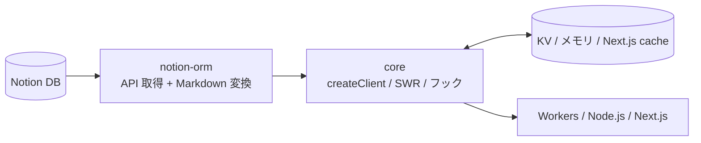

# notion-headless-cms

[](https://github.com/kjfsm/notion-headless-cms/actions/workflows/ci.yml)
[](https://github.com/kjfsm/notion-headless-cms/actions/workflows/e2e-nightly.yml)
[](https://codecov.io/gh/kjfsm/notion-headless-cms)
[](https://www.npmjs.com/package/@notion-headless-cms/core)

Notion をヘッドレス CMS として利用するための TypeScript ライブラリ群。Node.js・Next.js・Cloudflare Workers に対応。SWR キャッシュ・画像プロキシ・Webhook 受信を標準装備。

---

## 30 秒で動かす (Node.js)

### 1. インストール

```bash
pnpm add @notion-headless-cms/client @notion-headless-cms/cli
# peer deps（CLI 実行・スキーマ解決に必要）
pnpm add @notionhq/client zod notion-to-md
```

### 2. Notion インテグレーション設定

1. [Notion Integrations](https://www.notion.so/my-integrations) でインテグレーションを作成
2. 対象データベースをそのインテグレーションに「接続」
3. `NOTION_TOKEN=ntn_xxx` を環境変数に設定

Notion DB には最低限これらプロパティが必要です:

| プロパティ名 | タイプ | 役割 |
|---|---|---|
| Name (title) | タイトル | ページ名 |
| slug | テキスト | URL スラッグ（一意） |
| status | ステータス | 公開状態 |

### 3. スキーマ生成

```bash
# nhc.config.ts を作成
cat > nhc.config.ts << 'EOF'
import { defineConfig, env } from "@notion-headless-cms/cli";

export default defineConfig({
  notionToken: env("NOTION_TOKEN"),
  collections: {
    // dbName で Notion DB を検索して ID を自動解決します
    posts: { dbName: "ブログ記事DB", slugField: "slug", statusField: "status" },
  },
});
EOF

# スキーマ生成
npx nhc generate
```

### 4. クライアント作成

`createCMS` 一本で組み立てる。引数はデータの流れ「**取得 → 表現 → 永続化**」で
3 グループに分かれる：**`notion`（取得元: schema / token / 公開ポリシー）**、
**`render`（出力先: content / OGP）**、**`cache`（キャッシュ戦略）**。

```ts
// src/lib/cms.ts
import { createCMS } from "@notion-headless-cms/client";
import { schema } from "./generated/nhc.js";

export const cms = createCMS({
  notion: {
    schema,
    token: process.env.NOTION_TOKEN!,
    collections: {
      // published の値は schema の status options で型補完される
      posts: { published: ["公開済み"] },
    },
  },
  render: { content: "html" }, // "html" | "react"（取得戦略 + renderer を内部結線）
  // cache 省略時は in-process memory が既定（document / image 兼用）
});
```

### 5. データ取得

本文は **`async` メソッド** で取得する（`title` などのメタデータはプロパティ）。
取り出し方は `content` モードで型が切り替わる。

```ts
const posts = await cms.posts.list();
const post = await cms.posts.find("my-first-post");

// content: "html" のとき
const html = await post?.html();     // HTML 文字列（Hono / Express / Astro 等）
const md = await post?.markdown();   // Markdown 文字列

// content: "react" のとき
//   const blocks = await post?.notionBlocks(); // BlockObjectResponse ツリー（React 描画用）
```

> `content` モードでアクセサ型が切り替わるため、`"html"` で `notionBlocks()` を呼ぶような
> 不整合は型エラーになる。React 描画は下記「React Router」を参照。

---

## ランタイム別セットアップ

### Cloudflare Workers

```bash
pnpm add @notion-headless-cms/client @notion-headless-cms/cli
pnpm add @notionhq/client zod notion-to-md
```

```ts
// src/lib/cms.ts
import { createCMS } from "@notion-headless-cms/client";
import { kvCache, r2Cache } from "@notion-headless-cms/client/cloudflare";
import { schema } from "../generated/nhc";

export function makeCms(
  env: { NOTION_TOKEN: string; DOC_CACHE: KVNamespace; IMG_BUCKET: R2Bucket },
  ctx: ExecutionContext,
) {
  return createCMS({
    notion: {
      schema,
      token: env.NOTION_TOKEN,
      collections: { posts: { published: ["公開済み"] } },
    },
    render: { content: "html" },
    // document=KV / image=R2 を役割別に明示。どの binding がどのキャッシュか一目で分かる。
    cache: {
      document: kvCache({ namespace: env.DOC_CACHE }),
      image: r2Cache({ bucket: env.IMG_BUCKET }),
      waitUntil: (p) => ctx.waitUntil(p),
    },
  });
}
```

> **注意**: `ctx` (ExecutionContext) は必須です。省略すると SWR のバックグラウンド更新がレスポンス送信後に打ち切られ、キャッシュが更新されません。

### React Router (Cloudflare Workers)

React Router v7 (Framework mode) + Cloudflare Workers なら、loader でデータを取り、
`react-renderer` で Notion ブロックを React として描画できる。最短構成は次の 4 ファイル。

```bash
pnpm add @notion-headless-cms/client @notion-headless-cms/cli
pnpm add @notionhq/client zod notion-to-md react react-dom react-router
```

```ts
// app/lib/cms.ts — env / ctx を受け取って CMS を作る
import { createCMS } from "@notion-headless-cms/client";
import { kvCache, r2Cache } from "@notion-headless-cms/client/cloudflare";
import { schema } from "../generated/nhc";

export interface Env {
  NOTION_TOKEN: string;
  DOC_CACHE: KVNamespace;
  IMG_BUCKET: R2Bucket;
}

export function makeCms(env: Env, ctx: ExecutionContext) {
  return createCMS({
    notion: {
      schema,
      token: env.NOTION_TOKEN,
      collections: { posts: { published: ["公開済み"] } },
    },
    // content: "react" は blocks 取得戦略。loader で notionBlocks() を React 描画する。
    render: { content: "react" },
    cache: {
      document: kvCache({ namespace: env.DOC_CACHE }),
      image: r2Cache({ bucket: env.IMG_BUCKET }),
      waitUntil: (p) => ctx.waitUntil(p),
    },
  });
}
```

```ts
// workers/app.ts — env / ctx を loader に橋渡しする
import { createRequestHandler } from "react-router";

const requestHandler = createRequestHandler(
  () => import("virtual:react-router/server-build"),
  import.meta.env.MODE,
);

export default {
  async fetch(request, env, ctx) {
    return requestHandler(request, { cloudflare: { env, ctx } });
  },
} satisfies ExportedHandler<Env>;
```

```tsx
// app/routes/post.tsx — loader で取得し、React として描画
import { NotionRevalidator, Renderer } from "@notion-headless-cms/client/react";
import { makeCms } from "../lib/cms";
import type { Route } from "./+types/post";

export async function loader({ params, context }: Route.LoaderArgs) {
  const cms = makeCms(context.cloudflare.env, context.cloudflare.ctx);
  const post = await cms.posts.find(params.slug ?? "");
  if (!post) throw new Response("Not Found", { status: 404 });
  const blocks = await post.notionBlocks(); // NotionBlock[]（キャスト不要）
  return { blocks, title: post.title, lastEditedTime: post.lastEditedTime };
}

export default function Post({ loaderData }: Route.ComponentProps) {
  const { blocks, title } = loaderData;
  return (
    <article>
      {/* Notion を更新したら静かに loader を再走させる */}
      <NotionRevalidator />
      <h1>{title}</h1>
      <Renderer blocks={blocks} />
    </article>
  );
}
```

```ts
// app/routes/images.ts — 画像プロキシ（Notion の署名 URL 失効対策）
import { makeCms } from "../lib/cms";
import type { Route } from "./+types/images";

export async function loader({ params, context }: Route.LoaderArgs) {
  const cms = makeCms(context.cloudflare.env, context.cloudflare.ctx);
  const object = await cms.getCachedImage(params.hash ?? "");
  if (!object) return new Response("Not Found", { status: 404 });
  const headers = new Headers();
  if (object.contentType) headers.set("content-type", object.contentType);
  headers.set("cache-control", "public, max-age=31536000, immutable");
  return new Response(object.data, { headers });
}
```

ルート定義（`app/routes.ts`）に `/posts/:slug` と `/api/images/:hash` を登録する。

完全に動く例 → [`examples/cloudflare-react-router/`](./examples/cloudflare-react-router/)、
詳しい解説（KV ポーリング再検証・warm・キャッシュ戦略）→ [`docs/ja/recipes/react-router.md`](./docs/ja/recipes/react-router.md)。

### Next.js (App Router)

```bash
pnpm add @notion-headless-cms/client @notion-headless-cms/cache @notion-headless-cms/cli
pnpm add @notionhq/client zod notion-to-md
```

```ts
// app/lib/cms.ts
import { createCMS, memoryCache } from "@notion-headless-cms/client";
import { nextCache } from "@notion-headless-cms/client/next";
import { schema } from "@/app/generated/nhc";

export const cms = createCMS({
  notion: {
    schema,
    token: process.env.NOTION_TOKEN!,
    collections: { posts: { published: ["公開済み"] } },
  },
  render: { content: "html" },
  // document は Next.js の ISR、image は in-process メモリ
  cache: {
    document: nextCache({ tags: ["posts"] }),
    image: memoryCache(),
  },
});
```

```ts
// app/api/cms/[...path]/route.ts
import { createNextHandler } from "@notion-headless-cms/client/next";
import { cms } from "@/app/lib/cms";

const handler = createNextHandler(cms, { webhookSecret: process.env.REVALIDATE_SECRET });
export const GET = handler;
export const POST = handler;
```

このハンドラは画像プロキシ (`/api/cms/images/:hash`) と Webhook (`/api/cms/revalidate`) の 2 ルートをまとめて受ける。Notion 画像 URL は約 1 時間で失効するため、`cms` 経由で生成された HTML 内の画像はこのプロキシ URL (`/api/cms/images/{sha256}`) に書き換えられ、キャッシュから配信される。

ハンドラを使わず個別の route で受けたい場合のサンプル:

```ts
// app/api/cms/images/[hash]/route.ts
import { cms } from "@/app/lib/cms";

export async function GET(
  _req: Request,
  { params }: { params: Promise<{ hash: string }> },
) {
  const { hash } = await params;
  const image = await cms.getCachedImage(hash);
  if (!image) return new Response("Not Found", { status: 404 });
  return new Response(image.data, {
    headers: {
      "content-type": image.contentType,
      "cache-control": "public, max-age=31536000, immutable",
    },
  });
}
```

`createCMS` の画像プロキシは `/api/cms/images` に固定されており、`createNextHandler(cms)` が同じパスで配信する（個別 route の自前実装は不要）。

---

## 完全マテリアライズド方式で動かす (v3 / `@notion-headless-cms/cms`)

上記の `client`（v2）は「アクセス時に Notion と突合する SWR キャッシュ」型。それとは別に、
`@notion-headless-cms/cms`（v3）という**独立した**パッケージがもう一つのアーキテクチャを提供する:
Notion との同期をリクエスト経路から完全に切り離し、KV/R2 上にコンテンツをマテリアライズしておく方式。

| パッケージ | 役割 |
|---|---|
| `@notion-headless-cms/cms` | v3 単一パッケージ。マテリアライズドコンテンツレプリカ + 非同期同期。読者リクエスト処理中に Notion API を呼ばない |

どちらを選ぶかは要件次第で、優劣ではなく設計思想の違い:

- **v2 (`client`)**: オンデマンド SWR/TTL 取得。キャッシュ無し／薄いキャッシュ構成にも向く、アクセス時に鮮度を突合したい場合
- **v3 (`cms`)**: 完全事前同期 + push 型。読者 Worker の Notion API 呼び出し・レイテンシをゼロにしたい、Durable Object で同期を一元化したい場合

### スキーマ定義

`defineCollection`/`defineSchema` で TypeScript ファーストにスキーマを書く（codegen ではなく直接編集して育てる運用）。

```ts
// src/schema.ts
import { defineCollection, defineSchema, prop } from "@notion-headless-cms/cms";

const posts = defineCollection({
  dataSourceId: "d8221462-5ae9-8396-bdac-8731f4ef685a",
  slug: "slug",
  properties: {
    title: prop.title(),
    slug: prop.richText(),
    status: prop.status(["下書き", "編集中", "公開済み"] as const),
    publishedAt: prop.date(),
    author: prop.select(),
  },
  statusProperty: "status",
  published: ["公開済み"],       // list() に載せる値
  accessible: ["下書き", "編集中", "公開済み"], // find() を許す値（限定公開込み）
});

export const schema = defineSchema({ posts });
```

### Cloudflare Workers（stores + syncDelegate）

読者用の stateless Worker は KV/R2 の読み取りだけを行い、Notion API への直列アクセスは
`SyncCoordinatorDO`（Durable Object）に一元化する。

```ts
// src/lib/cms.ts — 読者側 Worker
import { createCMS } from "@notion-headless-cms/cms";
import {
  durableObjectSyncDelegate,
  kvDocStore,
  r2BlobStore,
} from "@notion-headless-cms/cms/cloudflare";
import { schema } from "../schema.js";

export function makeCms(env: Env, ctx: { waitUntil(p: Promise<unknown>): void }) {
  const id = env.SYNC_COORDINATOR.idFromName("global");
  const stub = env.SYNC_COORDINATOR.get(id);
  return createCMS({
    schema,
    stores: {
      docs: kvDocStore(env.DOC_CACHE),
      blobs: r2BlobStore(env.IMG_BUCKET),
    },
    syncDelegate: durableObjectSyncDelegate({ stub }),
    waitUntil: (p) => ctx.waitUntil(p),
  });
}
```

```ts
// src/lib/do.ts — Notion アクセスを直列化する Durable Object 側
import {
  createCMS,
  createDurableObjectSyncScheduler,
} from "@notion-headless-cms/cms";
import { createSyncCoordinatorDO, kvDocStore, r2BlobStore } from "@notion-headless-cms/cms/cloudflare";
import { schema } from "../schema.js";

export const SyncCoordinatorDO = createSyncCoordinatorDO({
  createCMS: (state, env) =>
    createCMS({
      schema,
      notion: { token: env.NOTION_TOKEN },
      stores: { docs: kvDocStore(env.DOC_CACHE), blobs: r2BlobStore(env.IMG_BUCKET) },
      scheduler: createDurableObjectSyncScheduler(state),
    }),
});
```

完全に動く例 → [`examples/cloudflare-hono/`](./examples/cloudflare-hono/)（`src/schema.ts` / `src/lib/cms.ts` / `src/lib/do.ts`）。

---

## パッケージ構成

### 利用側（これだけで揃う）

| パッケージ / サブパス | 役割 |
|---|---|
| `@notion-headless-cms/client` | `createCMS` 単一エントリ。全ランタイム共通 |
| `@notion-headless-cms/client/cloudflare` | `cloudflarePreset` / `restKvCache`（Cloudflare Workers） |
| `@notion-headless-cms/client/next` | `createNextHandler` / `nextPreset`（Next.js App Router） |
| `@notion-headless-cms/client/react` | `Renderer` / `NotionRevalidator`（React 描画） |
| `@notion-headless-cms/cli` | `nhc init` / `nhc generate` スキーマ生成 CLI |

### コアパッケージ（拡張作者向け）

| パッケージ | 役割 |
|---|---|
| `@notion-headless-cms/core` | CMS エンジン・SWR・キャッシュ抽象 |
| `@notion-headless-cms/notion-source` | Notion CMSAdapter 実装 |
| `@notion-headless-cms/cache` | キャッシュアダプタ (memory / cloudflare / next) |
| `@notion-headless-cms/markdown-html` | Markdown → HTML レンダラ |
| `@notion-headless-cms/block-html` | Notion ブロック拡張 HTML レンダラ |
| `@notion-headless-cms/fetch-blocks` | BlockObjectResponse ツリー取得（`notionBlocks()` 用）+ React `Renderer` |
| `@notion-headless-cms/fetch-markdown` | Notion Markdown Export API で本文を 1 リクエスト取得（Cloudflare Workers Free プランの 50 subrequest 制限対策） |
| `@notion-headless-cms/react-renderer` | BlockObjectResponse → React コンポーネント / 再検証フック |
| `@notion-headless-cms/notion-katex` | fetch 時に数式ブロックを KaTeX で pre-render し、Workers バンドルから katex を除外する拡張 |
| `@notion-headless-cms/notion-shiki` | fetch 時にコードブロックを shiki で pre-render し、Workers バンドルから shiki を除外する拡張 |
| `@notion-headless-cms/testing` | フェイク DataSource・フェイクキャッシュ・fixture クライアントのテストユーティリティ |
| `@notion-headless-cms/validate` | createClient / notionSource / CLI config を実行時検証する任意の zod ベースバリデーション |

---

## データフロー


```mermaid
flowchart LR
  notion[(Notion DB)]
  orm["notion-orm\nAPI 取得 + Markdown 変換"]
  core["core\ncreateClient / SWR / フック"]
  cache[(KV / メモリ / Next.js cache)]
  output["Workers / Node.js / Next.js"]

  notion --> orm --> core
  core <--> cache
  core --> output
```

---

## レンダラの選択

→ [`docs/ja/choosing-a-renderer.md`](./docs/ja/choosing-a-renderer.md)

---

## ドキュメント

- [クイックスタート](./docs/ja/quickstart.md)
- [アーキテクチャ](./docs/ja/architecture.md)
- [改善ロードマップ](./docs/ja/improvements.md)
- [レシピ集](./docs/ja/recipes/) — [Cloudflare Workers](./docs/ja/recipes/cloudflare-workers.md) / [React Router](./docs/ja/recipes/react-router.md) / [Next.js](./docs/ja/recipes/nextjs-app-router.md)
- [API リファレンス](./docs/ja/api/)

英語化に備えて `docs/{locale}/` の構造を採用しています。現在は `ja` のみ。

### 公式ドキュメントサイト (dogfooding)

[`apps/docs/`](./apps/docs/) は本ライブラリ自身で構築された公式サイトです。

- ランディング・固定ページは Notion DB から `@notion-headless-cms/client`（`/cloudflare`）で配信（dogfooding）
- ライブラリ本体の API リファレンス・レシピは `docs/ja/` 配下の md を静的レンダリング
- Cloudflare Workers + R2 + KV、`/api/revalidate` で Notion Webhook 受信

ローカル起動: `pnpm --filter @notion-headless-cms/docs dev`

---

## アーキテクチャと拡張

`createCMS` で足りない高度なケース（独自データソース・カスタム fetch 戦略）は、
`@notion-headless-cms/client` が re-export する低レベル API（`createClient` /
`notionSource` / `nodePreset` 等）を直接組み立てる escape hatch を使えます。

```ts
import { createClient, nodePreset } from "@notion-headless-cms/client";
import type { CMSAdapter } from "@notion-headless-cms/core/source-author";

// カスタムデータソースは CMSAdapter を実装する
const mySource: CMSAdapter = {
  collections: {
    articles: {
      source: myDataSource,
      slugField: "slug",
    },
  },
};

const cms = createClient({
  sources: { custom: mySource },
  ...nodePreset(),
});
```

詳細は [`docs/ja/architecture.md`](./docs/ja/architecture.md) を参照してください。

---

## 開発

```bash
pnpm install
pnpm build        # 全パッケージビルド
pnpm typecheck    # 型チェック
pnpm test         # テスト
pnpm format       # フォーマット
```

各 example の起動:

```bash
pnpm --filter example-node-hono dev
pnpm --filter example-cloudflare-hono dev
```
