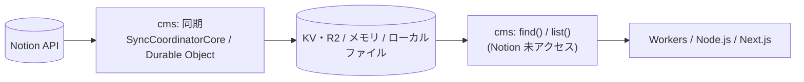

# notion-headless-cms

[](https://github.com/kjfsm/notion-headless-cms/actions/workflows/ci.yml)
[](https://github.com/kjfsm/notion-headless-cms/actions/workflows/e2e-nightly.yml)
[](https://codecov.io/gh/kjfsm/notion-headless-cms)
[](https://www.npmjs.com/package/@notion-headless-cms/cms)

Notion をヘッドレス CMS として利用するための TypeScript ライブラリ群。Node.js・Next.js・Cloudflare Workers に対応。SWR キャッシュ・画像プロキシ・Webhook 受信を標準装備。

---

## 30 秒で動かす (Node.js)

### 1. インストール

```bash
pnpm add @notion-headless-cms/cms
pnpm add -D @notion-headless-cms/cli
# peer dep（Notion API クライアント）
pnpm add @notionhq/client
```

### 2. Notion インテグレーション設定

1. [Notion Integrations](https://www.notion.so/my-integrations) でインテグレーションを作成
2. 対象データベースをそのインテグレーションに「接続」
3. `NOTION_TOKEN=ntn_xxx` を環境変数に設定

Notion DB には最低限これらプロパティが必要です:

| プロパティ名 | タイプ | 役割 |
|---|---|---|
| Name (title) | タイトル | ページ名 |
| slug | テキスト | URL スラッグ（一意） |
| status | ステータス | 公開状態 |

### 3. スキーマの雛形を作る

スキーマ本体は codegen ではなく TS ファースト（`defineCollection`/`defineSchema`）で書き、
育てていく運用。`nhc pull` が Notion DB を introspect して雛形を一度だけ生成する。

```bash
# nhc.config.ts を作成
cat > nhc.config.ts << 'EOF'
import { defineConfig, env } from "@notion-headless-cms/cli";

export default defineConfig({
  notionToken: env("NOTION_TOKEN"),
  schemaModule: "src/schema.ts",
  collections: {
    // dbName で Notion DB を検索して ID を自動解決します
    posts: { dbName: "ブログ記事DB" },
  },
});
EOF

# Notion DB を introspect して雛形を src/collections/ に生成
NOTION_TOKEN=secret_xxx npx nhc pull
```

生成された雛形を `src/schema.ts` に移し、必要に応じて `published`/`accessible` などを調整する
（そのまま `nhc.config.ts` の `schemaModule` が指すパスに置けば `nhc check`/`nhc doctor` から検証できる）。

```ts
// src/schema.ts
import { defineCollection, defineSchema, prop } from "@notion-headless-cms/cms";

const posts = defineCollection({
  dataSourceId: "d8221462-5ae9-8396-bdac-8731f4ef685a",
  slug: "slug",
  properties: {
    title: prop.title(),
    slug: prop.richText(),
    status: prop.status(["下書き", "編集中", "公開済み"] as const),
    publishedAt: prop.date(),
    author: prop.select(),
  },
  statusProperty: "status",
  published: ["公開済み"],       // list() に載せる値
  accessible: ["下書き", "編集中", "公開済み"], // find() を許す値（限定公開込み）
});

export const schema = defineSchema({ posts });
```

### 4. クライアント作成

`createCMS` は Notion アクセス・同期・ストレージ・HTTP 配信を1つに束ねる唯一のエントリ。
**読者リクエスト処理中は Notion API を一切呼ばない**のが北極星で、実際の同期（Notion 取得）は
`sync.kick()`（または webhook / Cron）が担う。`stores`/`scheduler` を省略すると in-memory
実装にフォールバックするため、KV/R2/DO が無くても最小構成で動く。

```ts
// src/lib/cms.ts
import { createCMS } from "@notion-headless-cms/cms";
import { schema } from "../schema.js";

export const cms = createCMS({
  schema,
  notion: { token: process.env.NOTION_TOKEN ?? "" },
});
```

### 5. データ取得

同期をキックしてから読み取る。`kick()` は 1 チャンク（既定 2 件）だけ処理する設計のため、
一括スクリプトとして全件を反映したい場合は cursor が尽きるまで手動で回す。

```ts
let state = await cms.sync.getState();
do {
  await cms.sync.kick();
  state = await cms.sync.getState();
} while (state.cursor !== null);

const { items: posts } = await cms.posts.list(); // { items, nextCursor, hasMore }
const post = await cms.posts.find("my-first-post"); // EntrySnapshot | null

// メタデータはプロパティ、本文は正規化済みブロック配列
console.log(post?.meta.title, post?.slug);
console.log(post?.blocks); // NormalizedBlock[]（JSON 互換）
```

本文（`blocks`）を HTML やコンポーネントとして描画する方法は下記
「[レンダラの選択](./docs/ja/choosing-a-renderer.md)」を参照。

---

## ランタイム別セットアップ

いずれのランタイムでも `createCMS` の組み立て方は同じで、違うのは `stores`（`docs`/`blobs` の
永続化先）と `scheduler`/`syncDelegate`（Notion 同期の駆動方法）だけ。

### Cloudflare Workers（KV/R2 + Durable Object）

読者用の stateless Worker は KV/R2 の読み取りだけを行い、Notion API への直列アクセスは
`SyncCoordinatorDO`（Durable Object）に一元化する。

```ts
// src/lib/cms.ts — 読者側 Worker
import { createCMS } from "@notion-headless-cms/cms";
import {
  durableObjectSyncDelegate,
  kvDocStore,
  r2BlobStore,
} from "@notion-headless-cms/cms/cloudflare";
import { schema } from "../schema.js";

export interface Env {
  readonly NOTION_TOKEN: string;
  readonly DOC_CACHE: KVNamespace;
  readonly IMG_BUCKET: R2Bucket;
  readonly SYNC_COORDINATOR: DurableObjectNamespace;
}

export function makeCms(
  env: Env,
  ctx: { waitUntil(p: Promise<unknown>): void },
) {
  const id = env.SYNC_COORDINATOR.idFromName("global");
  const stub = env.SYNC_COORDINATOR.get(id);
  return createCMS({
    schema,
    stores: {
      docs: kvDocStore(env.DOC_CACHE),
      blobs: r2BlobStore(env.IMG_BUCKET),
    },
    syncDelegate: durableObjectSyncDelegate({ stub }),
    waitUntil: (p: Promise<unknown>) => ctx.waitUntil(p),
  });
}
```

```ts
// src/lib/do.ts — Notion アクセスを直列化する Durable Object 側
import type { DurableObjectStateLike } from "@notion-headless-cms/cms";
import {
  createCMS,
  createDurableObjectSyncScheduler,
} from "@notion-headless-cms/cms";
import {
  createSyncCoordinatorDO,
  kvDocStore,
  r2BlobStore,
} from "@notion-headless-cms/cms/cloudflare";
import { schema } from "../schema.js";
import type { Env } from "./cms.js";

export const SyncCoordinatorDO = createSyncCoordinatorDO<Env>({
  createCMS: (state: DurableObjectStateLike, env: Env) =>
    createCMS({
      schema,
      notion: { token: env.NOTION_TOKEN },
      stores: {
        docs: kvDocStore(env.DOC_CACHE),
        blobs: r2BlobStore(env.IMG_BUCKET),
      },
      scheduler: createDurableObjectSyncScheduler(state),
    }),
});
```

同期のトリガーは Notion webhook（`cms.fetch(request)` が受ける）と、削除検知用の Cron
Trigger（`cms.scheduled()` → DO の `reconcile()`）。完全に動く例 →
[`examples/cloudflare-hono/`](./examples/cloudflare-hono/)（`src/schema.ts` /
`src/lib/cms.ts` / `src/lib/do.ts`）。

### React Router (Cloudflare Workers)

Durable Object 無しでも、KV/R2 + Worker isolate 内スケジューラで動かせる（isolate の
入れ替わりでカーソルは失われるが、差分クエリが既存 version と一致すれば打ち切るため
再同期コストは小さい）。

```ts
// app/lib/cms.ts
import { createCMS, createNodeSyncScheduler } from "@notion-headless-cms/cms";
import { kvDocStore, r2BlobStore } from "@notion-headless-cms/cms/cloudflare";
import { schema } from "../schema.js";

export interface Env {
  readonly NOTION_TOKEN: string;
  readonly DOC_CACHE: KVNamespace;
  readonly IMG_BUCKET: R2Bucket;
}

export function makeCms(
  env: Env,
  ctx: { waitUntil(p: Promise<unknown>): void },
) {
  return createCMS({
    schema,
    notion: { token: env.NOTION_TOKEN },
    stores: {
      docs: kvDocStore(env.DOC_CACHE),
      blobs: r2BlobStore(env.IMG_BUCKET),
    },
    scheduler: createNodeSyncScheduler(),
    waitUntil: (p: Promise<unknown>) => ctx.waitUntil(p),
  });
}

export async function ensureSynced(cms: ReturnType<typeof makeCms>) {
  let state = await cms.sync.getState();
  do {
    await cms.sync.kick();
    state = await cms.sync.getState();
  } while (state.cursor !== null);
}
```

```tsx
// app/routes/post.tsx — loader で取得し、React として描画
import { NotionRenderer } from "@notion-headless-cms/react-renderer";
import {
  denormalizeBlocks,
  toPageLinkMap,
} from "@notion-headless-cms/react-renderer/cms";
import { useNotionRevalidate } from "@notion-headless-cms/react-renderer/router";
import { data } from "react-router";
import { ensureSynced, makeCms } from "../lib/cms";
import type { Route } from "./+types/post";

export async function loader({ params, context }: Route.LoaderArgs) {
  const cms = makeCms(context.cloudflare.env, context.cloudflare.ctx);
  await ensureSynced(cms);
  const post = await cms.posts.find(params.slug ?? "");
  if (!post) throw data("Not Found", { status: 404 });
  return { post };
}

export default function Post({ loaderData }: Route.ComponentProps) {
  const { post } = loaderData;
  const meta = post.meta as { title?: string | null };
  useNotionRevalidate(); // mount / 再フォーカス時に loader を再走させる
  return (
    <article>
      <h1>{meta.title ?? post.slug}</h1>
      <NotionRenderer
        blocks={denormalizeBlocks(post.blocks)}
        pageLinks={toPageLinkMap(post.links)}
      />
    </article>
  );
}
```

ルート定義（`app/routes.ts`）で `/api/cms/*` を `cms.fetch(request)` に委譲するルートへ
まとめて向ける（画像プロキシ・OGP・webhook を 1 本で受けられる）。

完全に動く例 → [`examples/cloudflare-react-router/`](./examples/cloudflare-react-router/)。

### Next.js (App Router / Vercel)

Vercel の serverless/edge 関数はインスタンス間でメモリを共有しないため、in-memory store は
永続しない（コールドスタートのたびに再同期が必要）。永続化したい場合は Vercel KV/Blob 向けの
`DocStore`/`BlobStore` 実装に差し替える（実装契約は `@notion-headless-cms/cms/testing` の
ストア契約テストを参照）。

```ts
// app/lib/cms.ts
import {
  createCMS,
  createNodeSyncScheduler,
  memoryBlobStore,
  memoryDocStore,
} from "@notion-headless-cms/cms";
import { schema } from "@/app/schema";

type Cms = ReturnType<typeof createCMS<typeof schema>>;

let instance: Cms | undefined;

// `next build` はモジュールを import するだけで実行しないため、トップレベルで
// createCMS() を呼ぶと NOTION_TOKEN が無いビルド環境でビルドが失敗する。
// 構築を実際に使う時点まで遅延することでこれを避ける。
export function getCms(): Cms {
  if (!instance) {
    instance = createCMS({
      schema,
      notion: { token: process.env.NOTION_TOKEN ?? "" },
      stores: { docs: memoryDocStore(), blobs: memoryBlobStore() },
      scheduler: createNodeSyncScheduler(),
      webhookSecret: process.env.REVALIDATE_SECRET,
    });
  }
  return instance;
}

let syncing: Promise<void> | null = null;

export async function ensureSynced(): Promise<Cms> {
  const cms = getCms();
  if (!syncing) {
    syncing = (async () => {
      let state = await cms.sync.getState();
      do {
        await cms.sync.kick();
        state = await cms.sync.getState();
      } while (state.cursor !== null);
    })();
  }
  await syncing;
  return cms;
}
```

```ts
// app/api/cms/[...path]/route.ts — 画像プロキシ・OGP・webhook を cms.fetch() 1 本に委譲
import { getCms } from "@/app/lib/cms";

export async function GET(request: Request) {
  return getCms().fetch(request);
}

export async function POST(request: Request) {
  return getCms().fetch(request);
}
```

```tsx
// app/posts/[slug]/page.tsx
import { NotionRenderer } from "@notion-headless-cms/react-renderer";
import {
  denormalizeBlocks,
  toPageLinkMap,
} from "@notion-headless-cms/react-renderer/cms";
import { NotionRevalidator } from "@notion-headless-cms/react-renderer/next";
import { notFound } from "next/navigation";
import { ensureSynced } from "@/app/lib/cms";

export default async function PostPage({
  params,
}: {
  params: Promise<{ slug: string }>;
}) {
  const { slug } = await params;
  const cms = await ensureSynced();
  const post = await cms.posts.find(slug);
  if (!post) notFound();

  return (
    <article>
      <NotionRevalidator />
      <h1>{post.slug}</h1>
      <NotionRenderer
        blocks={denormalizeBlocks(post.blocks)}
        pageLinks={toPageLinkMap(post.links)}
        ogpEndpoint="/api/cms/ogp"
      />
    </article>
  );
}
```

完全に動く例 → [`examples/vercel-nextjs/`](./examples/vercel-nextjs/)。

---

## パッケージ構成

このリポジトリの現行アーキテクチャは `@notion-headless-cms/cms` の 1 パッケージに集約されている
（他 workspace パッケージへの依存を持たない独立パッケージ）。`react-renderer` / `cli` はいずれも
`cms` にのみ依存する。

| パッケージ / サブパス | 役割 |
|---|---|
| `@notion-headless-cms/cms` | `createCMS` 単一エントリ。Notion アクセス・同期・ストレージ・HTTP 配信を統合 |
| `@notion-headless-cms/cms/cloudflare` | `kvDocStore` / `r2BlobStore` / `createSyncCoordinatorDO` / `durableObjectSyncDelegate`（Cloudflare Workers） |
| `@notion-headless-cms/cms/node` | `fileDocStore` / `fileBlobStore`（`node:fs` に依存する Node 専用ランタイム実装） |
| `@notion-headless-cms/cms/html` | React を使わない HTML レンダラ |
| `@notion-headless-cms/cms/testing` | `DocStore`/`BlobStore` 実装の契約テストユーティリティ |
| `@notion-headless-cms/react-renderer` | 正規化ブロック（`NormalizedBlock[]`）→ React コンポーネント / 再検証フック |
| `@notion-headless-cms/cli` | `nhc init` / `nhc pull` / `nhc check` / `nhc doctor` / `nhc sync` |

---

## データフロー

**読者リクエスト処理中は Notion API を一切呼ばない**のが北極星。Notion との同期はリクエスト
経路の外側（webhook / Cron / ローカル kick）で行われ、`find()`/`list()` はストアを読むだけで完結する。


```mermaid
flowchart LR
  notion[(Notion API)]
  sync["cms: 同期\nSyncCoordinatorCore / Durable Object"]
  stores[(KV・R2 / メモリ / ローカルファイル)]
  query["cms: find() / list()\n(Notion 未アクセス)"]
  output["Workers / Node.js / Next.js"]

  notion --> sync --> stores
  stores --> query --> output
```

---

## canary（main の最新を試す）

main へマージされた変更は、正式な `latest` リリースを待たずに `canary` タグとして npm へ自動公開されている（`0.0.0-canary-<commit sha>` 形式）。

```bash
pnpm add @notion-headless-cms/cms@canary @notion-headless-cms/react-renderer@canary
```

- `0.0.0-canary-*` は prerelease のため `^3.x` のような semver range には解決されない。`latest` を使う既存ユーザーへ影響が及ぶことはない。
- 依存関係も同じ commit の canary で解決されるため、`pnpm add ...@canary` は毎回 exact pin として `package.json` / `pnpm-lock.yaml` に記録される（再現性のため caret を付けない）。
- 動作保証は無い（unpublish はしないが latest ほど検証されていない）。壊れた canary を掴んだ場合は 1 つ前の canary（過去の commit sha）へ pin し直せば復旧できる。

## レンダラの選択

→ [`docs/ja/choosing-a-renderer.md`](./docs/ja/choosing-a-renderer.md)

---

## ドキュメント

- [クイックスタート](./docs/ja/quickstart.md)
- [アーキテクチャ](./docs/ja/architecture.md)
- [改善ロードマップ](./docs/ja/improvements.md)
- [レシピ集](./docs/ja/recipes/) — [Cloudflare Workers](./docs/ja/recipes/cloudflare-workers.md) / [React Router](./docs/ja/recipes/react-router.md) / [Next.js](./docs/ja/recipes/nextjs-app-router.md)
- [API リファレンス](./docs/ja/api/)
- [v2 アーキテクチャ削除 → cms 移行ガイド](./docs/ja/migration/v2-removal.md)

英語化に備えて `docs/{locale}/` の構造を採用しています。現在は `ja` のみ。

### 公式ドキュメントサイト (dogfooding)

[`apps/docs/`](./apps/docs/) は本ライブラリ自身で構築された公式サイトです。

- ランディング・固定ページは Notion DB から `@notion-headless-cms/cms`（`/cloudflare`）で配信（dogfooding）
- ライブラリ本体の API リファレンス・レシピは `docs/ja/` 配下の md を静的レンダリング
- Cloudflare Workers + R2 + KV、`/api/cms/webhook` で Notion Webhook 受信

ローカル起動: `pnpm --filter @notion-headless-cms/docs dev`

---

## アーキテクチャと拡張

`createCMS` の既定挙動で足りない高度なケースは、以下の差し替え口（escape hatch）で対応します。

- **`transforms`**: shiki（コード）/ katex（数式）のような同期時の事前レンダー拡張。
  `TransformStage`（`transform(blocks)` を実装する純関数的な契約）を自作して渡せます。
- **`stores.docs` / `stores.blobs`**: KV/R2 以外の永続化先（Vercel KV/Blob 等）に差し替える場合は
  `DocStore`/`BlobStore` を自作します。`@notion-headless-cms/cms/testing` の契約テスト
  （`runDocStoreContract` / `runBlobStoreContract`）で実装の互換性を検証できます。
- **`syncDelegate`**: Durable Object 以外の場所（別サービス等）に同期制御を委譲したい場合の口。

```ts
import type { TransformStage } from "@notion-headless-cms/cms";

const myTransform: TransformStage = {
  name: "my-transform",
  async transform(blocks) {
    // blocks を加工した新しい配列を返す
    return blocks;
  },
};

const cms = createCMS({ schema, notion: { token }, transforms: [myTransform] });
```

詳細は [`docs/ja/architecture.md`](./docs/ja/architecture.md) を参照してください。

---

## 開発

```bash
pnpm install
pnpm build        # 全パッケージビルド
pnpm typecheck    # 型チェック
pnpm test         # テスト
pnpm format       # フォーマット
```

各 example の起動:

```bash
pnpm --filter example-node-hono dev
pnpm --filter example-cloudflare-hono dev
```
